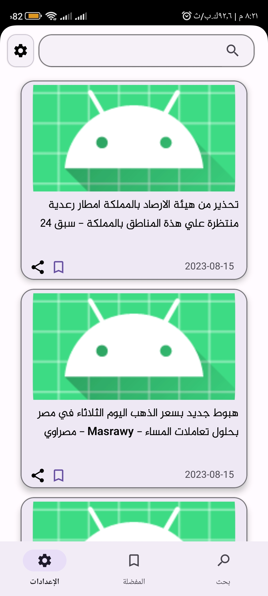
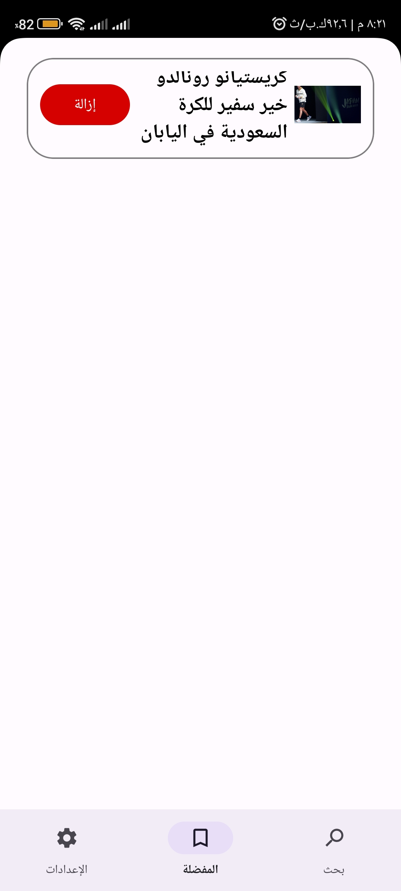
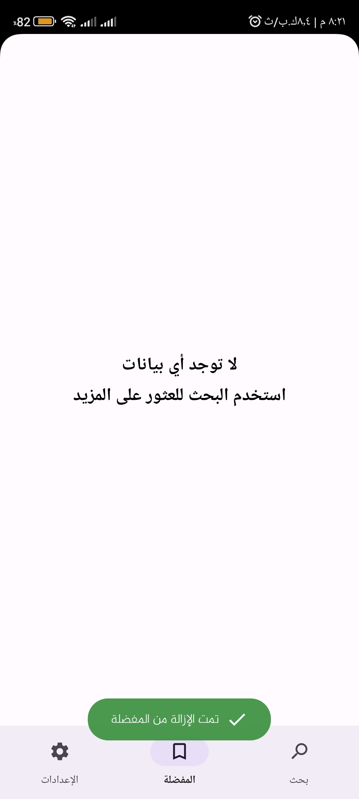
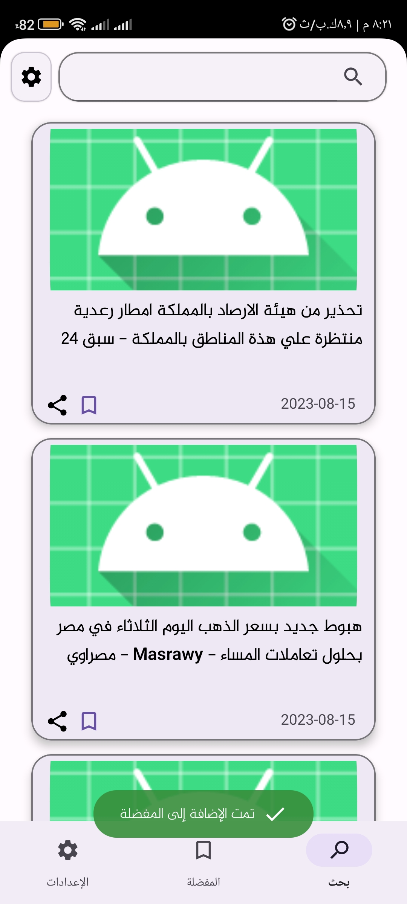
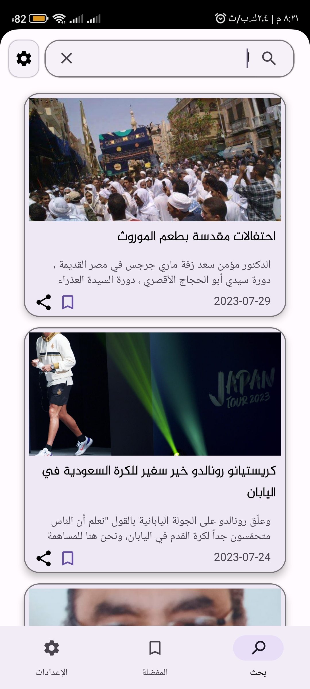
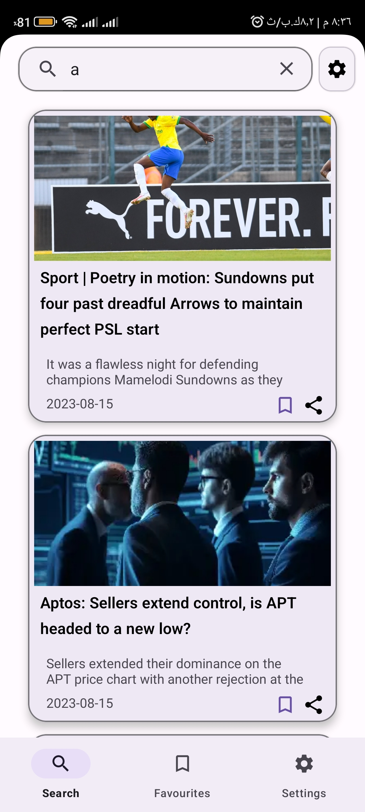

# Hot Articles App
using news api

* Used in This Project
* Android Studio
* Clean Architecture and MVVM 
* Repository Pattern
* Retrofit
* Moudules
* hilt (DI)
* unit testing
* Data binding
* Modularisation
* ROOM for local database caching
* Coroutines
* Flow

# Languages
* Kotlin and Java

** Images

# installing App

<a href="https://raw.githubusercontent.com/AhmedMHassaan/OrangeTask/master/APK/articles.apk" target="_blanc">Download<a/>
